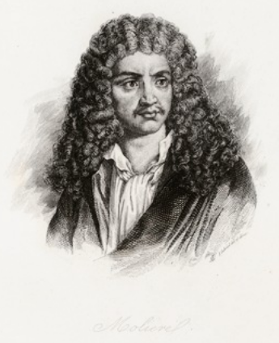

# WHAT'S THIS PROJECT ALL ABOUT?
**Molière** is an extension of Gherkin which generates the [ScreenPlay Design Pattern](https://ideas.riverglide.com/page-objects-refactored-12ec3541990#.ekkiguobe) (SPDP).

The idea rose from [Micha Kutz' talk on *"Writing tests like Shakespeare"*](https://youtu.be/Ptg5NICosNY?t=5870)
(hence the name of this project)

The aim is to extend Gherkin grammar with some extra info to generate class stubs compliant with SPDP
## Gherkin extension
Language definition proposed by **Molière**:
```
GIVEN <Actor> who can <Ability> [and <Ability>]+
WHEN {<Actor> does <Task> {at|with|in} <Parameters>}
                [and <Task> {at|with|in} <Parameters>}]+
THEN <Actor> checks <Question> is <Assertion> THANKS TO <element> FOUND ON <screen>
                [and <Question> is <Assertion> THANKS TO <element> FOUND ON <screen>]+
```
This preformatted text includes items (between <>) that will generate SPDP classes 
with links between them along with methods found from this grammar
See [tests/test_generate_screenplay.py](https://github.com/Moustov/ScreenPlay_Shakespeare/blob/master/tests/test_generate_screenplay.py)

This grammar is still compatible with Gherkin to let people transition from Gherkin to **Molière**.

## Screenplay Overview
SPDP is a [SOLID](https://en.wikipedia.org/wiki/SOLID) compatible architecture (use a [PlantUML viewer](http://www.plantuml.com/plantuml/uml/) ): 

```
@startuml
    ScreenPlay "0" o-- "n" Actor
    ScreenPlay "0" o-- "n" Fact
    ScreenPlay "0" o-- "n" Question
    ScreenPlay "0" o-- "n" Element
    ScreenPlay "0" o-- "n" Task
    ScreenPlay "0" o-- "n" Action
    ScreenPlay "0" o-- "n" Screen
    Actor "0" o-- "n" Ability : has
    Actor "0" o-- "n" Task : performs
    Actor "0" o-- "n" Question : asks
    Actor "0" o-- "n" Fact : learns/remembers
    Fact "0" o-- "n" Question : enable
    Question "0" o-- "n" Element : about the state of
    Element "0" o-- "n" Screen : on a
    Task "0" o-- "n" Action : made up of
    Ability "0" o-- "n" Action : enables
    Action "0" o-- "n" Element : interacts with
    
    class ScreenPlay{
        screens: Screen[]
        actors: Actor[]
        actions: Action[]
        tasks: Task[]
        elements: Element[]
        abilities: Ability[]
        facts: Fact[]
        questions: Question[]
        test_scripts: str[] * see hereunder
        play_test_script()
    }
    class Actor{
        tasks: Task[]
        abilities: Ability[]
        facts: Fact[]
        questions: Question[]
    }
    class Fact{
        questions: Question[]
    }
    class Ability{
        actions: Action[]
    }
    class Task{
        actions: Action[]
    }
    class Action{
        elements: Element[]
    }
    class Question{
        elements: Element[]
    }
    class Element{
        on_the_screen: Screen
    }
    class Screen{
        elements: Element[]
    }
@enduml
```

* ScreenPlay.test_scripts: each test_script is a scenario that would look like a **Molière** scenario
#_**todo:** update readme with full example from an SPDP scenario to the generated scenario + test output_

Example:\
From a **Molière** scenario
generated from an SPDP scenario with `moliere_core_domain.play_test_script("act 1", scenario)`

```
def main():
    test_script = """
    Act 1 - scene 1 - "John" does "sequence #1"
        # SCENE SETUP
            an_actor.name = "John"
            element_1.can_be_found_on(page_1)
            element_2.can_be_found_on(page_1)
            element_3.can_be_found_on(page_2)
            element_4.can_be_found_on(page_1)
            element_5.can_be_found_on(the_mailbox)
            action_1.add_interaction(element_1)
            action_2.add_interaction(element_3)
            a_task.set_sequence([{"task": "sequence #1", 
                                "actions": [{"sequence": 1, "action": action_1, "param": 123}, 
                                            {"sequence": 2, "action": action_2, "param": click}])
        # SCENE PLAY
            an_actor.accomplishes(a_task)

    Act 1 - scene 2 - "a Tester" does "sequence #2"
        # SCENE SETUP
            another_actor.name = "a Tester"
            action_3.add_interaction(element_4)
            action_4.add_feedback(element_5)
            checks_1 = [{"task": "sequence of checks #2", 
                        "actions": [{"action": action_3, "sequence": 1, "param": 456},
                                    {"check": action_4, "sequence": 2}]
        # SCENE PLAY
            a_test.set_actions(checks_1)
            feedback = another_actor.accomplishes(checks_1)
            print(feedback)
"""
    my_comedy = ScreenPlay("Much ado about nothing")
    output = my_comedy.play_test_script("act 1", test_script)
    print(output)
```    

output:
```
John does the sequence #1
    -> <action_1.name> with 123 on element_1 in page 1
    -> and <action_2.name> with a click on element_3 in page 2
Then a Tester does the sequence of checks #2
    -> <action_3.name> with 456
    <- and sees 32 EUR from element_5 in the_mailbox
```
As per ["doc as a test"](https://github.com/sfauvel/doc_as_test_pytest)
and ["Documentation Testing"](https://github.com/sfauvel/documentationtesting),
the output can simply be compared with previous outputs to check regression.
See [doctest](https://docs.python.org/3.8/library/doctest.html) as a possible library. 


## How to reach the example?
1. ideate SPDP gherkin-like scenarios
2. digest the scenario to generate SPDP classes & tests
3. implement the elements to interact with the screens
4. complete with some logic to implement business process by using elements
5. run the tests


# INSTALLATION
- works python 3.9
- run `pip install -r requirements.txt`
# BUILD

# RUN

# SEE ALSO
- https://github.com/perrygoy/screenpy/blob/trunk/screenpy/actor.py
